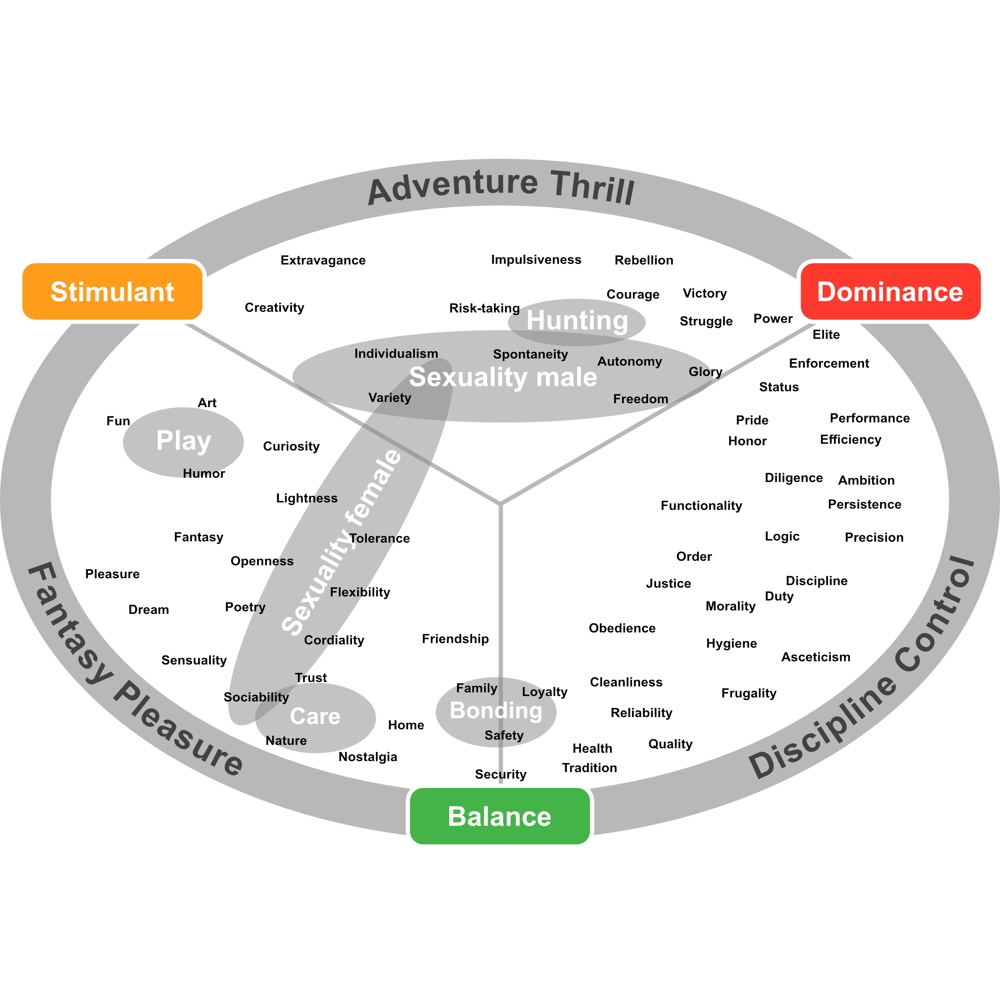

# How to design a website as a non-designer checklist

## 1. Define the goal / intention of your website
For example:
- Fill out the contact form and send it!
- Add product to shopping cart!
- Inform about the company!

## 2. Define target group
For example:
- Male aged 18 to 45, interested in soccer and music, grounded, have/want to start a family, etc.
- Female aged 35 to 50, is interested in healthy diet and fitness, has had some surgeries,
  is concerned about your health, etc.

## 3. Emotions
Which emotion do you want to trigger in the audience with your website?[^limbicmap]

[^limbicmap]: Based on Häusel, Hans-Georg (2010): Emotional Boosting. Die hohe Kunst der Kaufverführung, München: Haufe.
Page 30

## 4. Find template
Search for templates on e.g., [themeforest](https://themeforest.net).

If you do not have enough choice for your use case, consider the following.
Think about which industry has the same target group and works with the same emotions.
Search for templates from this industry.

## 5. Extract color palette
Especially these colors should be defined.

- Primary color
- Secondary color
- Text color
- Background color.

## 6. Select a font
Check with [Google Fonts](https://fonts.google.com) or [dafont.com](https://www.dafont.com) for licenses and terms of
use.

## 7. Select icons
### Icon-Sets
- [JAM](https://jam-icons.com)
- [Fontisto icons](https://fontisto.com/icons)
- [iconmonstr](https://iconmonstr.com)
- [Evil Icons](https://evil-icons.io)
- [ionicons](https://ionic.io/ionicons)
- [Google Fonts/Icons](https://fonts.google.com/icons)
- [Feather](https://feathericons.com)
- [Font Awesome](https://fontawesome.com)
- [Lineicons](https://lineicons.com)

### Single icons
- [ICONFINDER](https://www.iconfinder.com/icons)
- [flaticon](https://www.flaticon.com)

## 8. Choose images

### Photos
- [Pexels](https://www.pexels.com)
- [pixabay](https://pixabay.com)
- [Unsplash](https://unsplash.com)

### Vector graphics and illustrations
- [rawpixel](https://www.rawpixel.com)
- [Vecteezy](https://www.vecteezy.com)
- [freepik](https://www.freepik.com)

Adjust color if necessary.

## 9. Writing texts
- As short and few texts as possible.
- Get to the point.
- Be specific.

Get inspiration at [copy.ai](https://www.copy.ai).
Check texts with [grammarly](https://www.grammarly.com), for example.